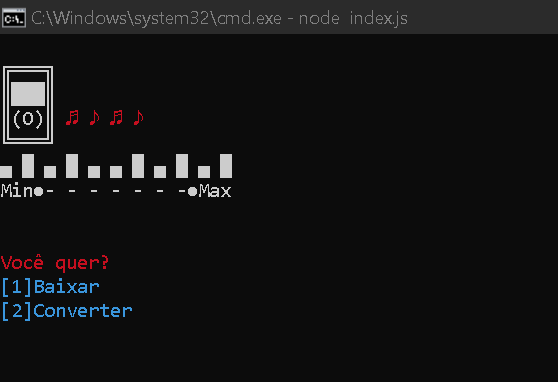

# BAIXADOR-E-CONVERSOR-DE-MUSICA
Feito com NodeJS, um programa com o intuito de baixar músicas,playlists e converter video para audio.

# Como usar?
Para usa-lo é necessario apenas o javascript(NodeJS) instalado. Entre na pasta e abra um terminal naquele diretorio, em seguida escreva:

`node index.js`

E então é só aproveitar

