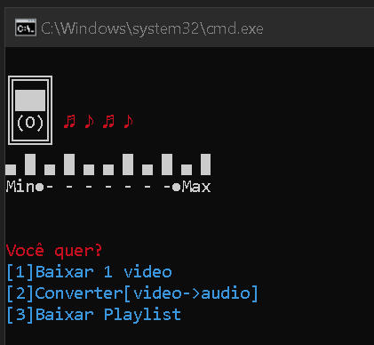

# BAIXADOR-E-CONVERSOR-DE-MUSICA
Feito com NodeJS, um programa com o intuito de baixar músicas,playlists e converter video para audio.

# Como usar?
Para usa-lo é necessario apenas o javascript(NodeJS) instalado. 
Execute esse comando para instalar as dependências:
`npm i`

Execute o comando para inicializar o programa:
`npm start`

ou

abrar o setup.bat, apenas se seu sistema operacional for Windows

E então é só aproveitar

